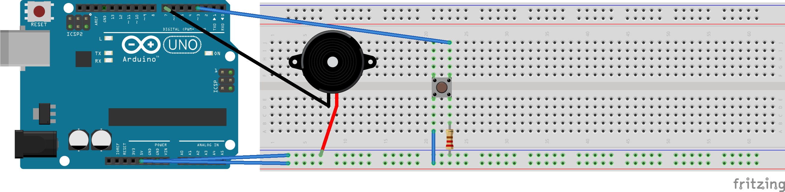

# arduino-buzzer-music



## **1. Overview**

This project implements a hardware-based stochastic (random) tone generator using an Arduino-compatible microcontroller. The core functionality is the generation of a pseudo-random musical note from a predefined melody sequence (a simplified excerpt from "Happy Birthday") with a randomized duration each time a tactile button is engaged. The system distinguishes itself through the use of a high-quality, embedded pseudo-random number generator (PRNG) – the **RomuDuo** algorithm – for all stochastic decisions, ensuring a non-repeating, high-entropy sequence without reliance on external entropy sources.

The device operates in a simple trigger-response manner: a **HIGH** signal on the button input pin initiates a sound event comprising a random note and a random pause. The absence of a button press silences the piezo buzzer. This makes it suitable for applications in experimental music interfaces, generative sound installations, or as an educational tool for demonstrating embedded PRNGs and audio synthesis.

## **2. System Architecture & Operational Principle**

A high-level system block diagram is presented below:

```mermaid
graph TD
    A[User Input] -->|Physical Press| B[Tactile Button]
    B -->|Digital HIGH Signal| C[Arduino UNO<br>ATmega328P]
    C --> D{Main Control Loop}
    D --> E[Read Button Pin]
    E --> F{Button == HIGH?}
    F -->|Yes| G[RomuDuo PRNG Engine]
    G --> H[Generate Random Index: 0-7]
    G --> I[Generate Random Float: 1.1-1.9]
    H --> J[Fetch Note & Base Duration]
    I --> K[Calculate Scaled Pause]
    J --> L[Generate Tone on Piezo]
    K --> M[Delay for Pause Duration]
    L --> D
    F -->|No| N[Disable Tone noTone()]
    N --> D
```

**Operational Flow:**
1.  The microcontroller continuously polls the state of the digital input pin connected to the button.
2.  Upon detection of a `HIGH` logic level (button pressed), the firmware invokes the `romu_duo_range()` function to select a random integer index between 0 and 7.
3.  This index is used to retrieve a corresponding frequency value (in Hz) from the `melody[]` array and a base note denominator from the `noteDurations[]` array.
4.  The base note duration is calculated as `1000 / denominator` milliseconds.
5.  Concurrently, a random float multiplier between 1.1 and 1.9 is generated via `romu_duo_float_range()`. This multiplier scales the base note duration to create the final `pauseBetweenNotes`.
6.  The `tone()` function is called with the selected frequency and calculated note duration to drive the piezo buzzer.
7.  The system then pauses for the calculated `pauseBetweenNotes` interval before returning to the main loop, allowing the note to complete its envelope and creating a rhythmic variation.
8.  If the button is not pressed, the `noTone()` function is called to ensure the buzzer is silent.

## **3. Hardware Specification & Interfacing**

The system uses a minimal component set. The following table details the hardware components and their connections:

| Component | Specification | Connection to Arduino UNO | Purpose |
| :--- | :--- | :--- | :--- |
| **Microcontroller** | ATmega328P (Arduino UNO) | N/A | Core processing unit. |
| **Tactile Button** | Momentary SPST, normally-open | Pin 3 (`PLAY_BTN_PIN`) to one lead. Other lead to GND. Internal pull-up resistor is used via `INPUT` mode. | User input trigger. Provides a `HIGH` signal when pressed. |
| **Piezo Buzzer** | Passive (3-16Ω, 5V) | Anode (+, red) to Pin 7 (`BZR_PIN`). Cathode (-, black) to GND. | Sound output transducer. Generates tones at specified frequencies. |
| **Power Supply** | 5V DC (via USB or barrel jack) | N/A | Provides system power. |

## **4. Software & Algorithmic Description**

### **4.1. Core Libraries and Definitions**
- **`pitches.h`**: A header file containing standard pitch-to-frequency mappings for notes from B0 (31 Hz) to D8 (4978 Hz). This allows for musically accurate tone generation using the `tone()` function.
- **Arduino Core**: Utilizes standard `pinMode()`, `digitalRead()`, `tone()`, `noTone()`, and `delay()` functions for I/O control and timing.

### **4.2. The RomuDuo Pseudo-Random Number Generator**
This project's distinct feature is the software implementation of the **RomuDuo** PRNG, chosen for its speed, statistical quality, and minimal state footprint on a resource-constrained microcontroller.

| **Characteristic** | **RomuDuo Implementation** |
| :--- | :--- |
| **State Size** | 16 bytes (two 64-bit integers: `state1`, `state2`) |
| **Period** | ~2^63 (extremely long, non-repeating for embedded purposes) |
| **Core Operation** | Based on fast 64-bit multiplication, subtraction, and rotation. |
| **Seed** | Hardcoded to non-zero constants (`0x1234...`, `0xfedc...`). For true non-determinism, these could be seeded from an unconnected analog pin. |

**Key Functions:**
- `uint64_t romu_duo()`: Returns the next 64-bit pseudo-random value in the sequence. It is the engine for all other random functions.
- `uint64_t romu_duo_range(min, max)`: Generates a uniformly distributed random integer within a specified inclusive range. It employs rejection sampling to avoid modulo bias for non-power-of-two ranges.
- `float romu_duo_float()`: Generates a random floating-point number in the standard uniform range `[0.0, 1.0)` by manipulating IEEE 754 bit representations.
- `float romu_duo_float_range(min, max)`: Maps the standard uniform float to a specified continuous range `[min, max)`.

### **4.3. Melody and Timing Data**
```c
int melody[] = {NOTE_C4, NOTE_G3, NOTE_G3, NOTE_A3, NOTE_G3, 0, NOTE_B3, NOTE_C4};
int noteDurations[] = {4, 7, 7, 4, 4, 4, 4, 4};
```
- **`melody[]`**: Contains 8 elements. The value `0` represents a rest (silence).
- **`noteDurations[]`**: Corresponding denominators for a whole note. E.g., `4` = quarter note (1000/4 = 250 ms), `7` ≈ an eighth note triplet.

## **5. Build, Deployment & Operation**

### **5.1. Prerequisites**
- **Hardware:** Arduino UNO (or compatible), USB cable, breadboard, jumper wires, button, passive piezo buzzer.
- **Software:** `arduino-cli` toolchain installed and configured, or the Arduino IDE.
- **System:** `avrdude`, `make`.

### **5.2. Build and Flash Instructions**
The project includes a `Makefile` for automated building and uploading.

1.  **Connect Hardware:** Assemble the circuit as per Section 3.
2.  **Verify Port:** Confirm the Arduino's serial port (e.g., `/dev/ttyUSB0` or `COM3`).
3.  **Set Parameters:** Update `BOARD_TAG` and `ARDUINO_PORT` in the `Makefile` if necessary.
4.  **Compile & Upload:** Execute the following commands in the project root directory:
    ```bash
    # Compile the sketch
    make compile

    # Upload to the connected board
    make upload
    ```
    *Or use the combined command:*
    ```bash
    make all
    ```
5.  **Clean Build Artifacts:** `make clean`
6.  **Serial Monitor:** `make monitor` (though this sketch does not output serial data).

### **5.3. Usage**
1.  Power the Arduino via USB or an external 5V supply.
2.  The system is now active. Press and hold the tactile button.
3.  On each press detection, a random note from the melody will play with a randomized length, followed by a variable pause.
4.  Releasing the button immediately stops any sound.

## **6. Potential Modifications & Extensions**

- **Seed Entropy:** Initialize the RomuDuo state (`romu_duo_state1`, `romu_duo_state2`) by reading a floating analog pin (`analogRead(A7)`) during `setup()` for unique sequences on each power cycle.
- **Extended Melody:** Expand the `melody[]` and `noteDurations[]` arrays. Adjust the upper bound in `romu_duo_range(0, 7)` accordingly.
- **Dynamic Tempo:** Replace the constant `1000` in the duration calculation with a variable to change the overall tempo.
- **Polyphony/Effects:** Use a timer interrupt to manage tone generation, allowing for overlapping notes or envelope shaping (attack, decay).
- **MIDI Output:** Replace the piezo buzzer with a MIDI shield or serial-to-MIDI converter to control external synthesizers.

This project demonstrates a practical synthesis of embedded programming, algorithmic PRNGs, and basic audio synthesis. It showcases how a statistically robust random number generator like RomuDuo can be efficiently implemented on an 8/16-bit microcontroller to drive interactive, non-deterministic behavior. The clean separation between the PRNG engine, musical data, and control logic provides a solid foundation for further experimentation in generative music and responsive sound design.

